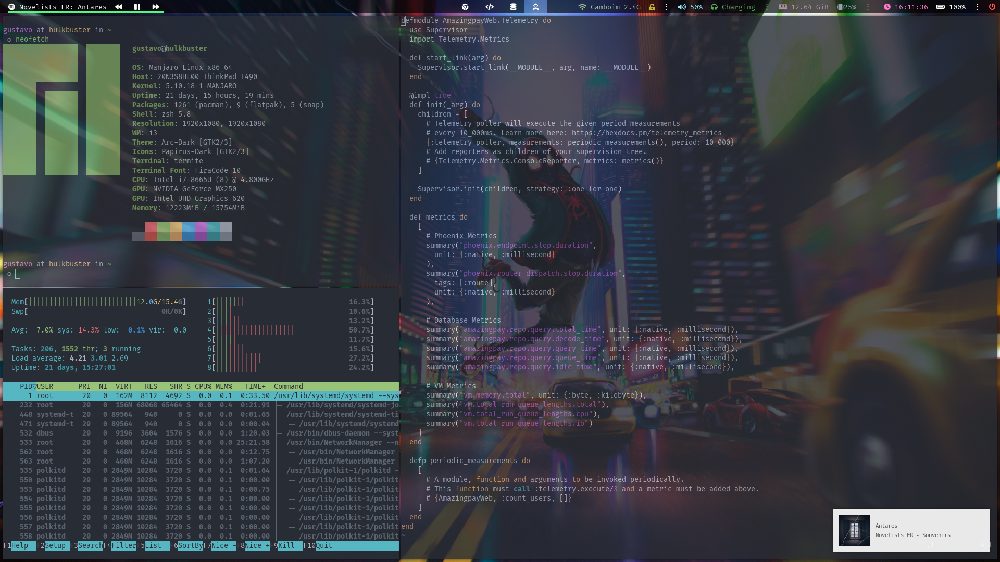

# My .dotfiles

My setup:

* Distro: [Manjaro](https://manjaro.org/)
* Window Manager: [i3-gaps](https://github.com/Airblader/i3)
* GTK Theme: [Arc-Dark](https://github.com/horst3180/arc-theme)
* Compositor: [Compton](https://github.com/chjj/compton)
* Notification Daemon: [Dunst](https://dunst-project.org)
* Terminal: [Termite](https://github.com/thestinger/termite)

# Thankful area

[thepabloaguilar](https://github.com/thepabloaguilar), who explained the advantages of using a .dotfiles repo, to have showed me the magic of i3, and how to configure almost all plugins.

[enricolo4](https://github.com/enricolo4) who helped me put the last single pieces on their right places and make some configurations works.

[r/unixporn](https://www.reddit.com/r/unixporn/), these guy are awesome and so full of creative content. A big part of my setup if from here.
